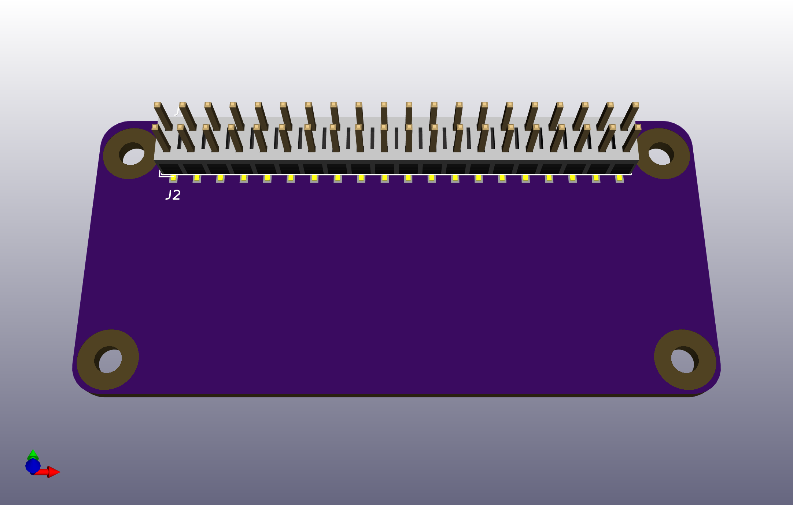

# Raspberry Pi Zero ~~pHat~~ uHat template

This a KiCad 5.0.0 template for a [Raspberry Pi Zero](https://www.raspberrypi.org/products/pi-zero/) sized uHat. It is based on the [Raspberry Pi B+ Hat template](https://github.com/xesscorp/RPi_Hat_Template) from Xess Corp. XESS Corp did all the hard work here.

Raspberry Pi Foundation has finally named these Raspberry Pi Zero sized hats which some called pHats. The new name is **Micro-Hat** or **uHat**. They also released a mechanical specification for them [here](https://github.com/raspberrypi/hats/blob/master/uhat-board-mechanical.pdf). Luckily these specifications exactly match the template. Note the new POE keepout area is not in this template. You will have to keep track of it yourself.

Both a thru-hole and a surface mount connector are provided, along with a different PCB edge for each. Just keep the PCB edge and connector type that you're using for your design and delete the others. The surface mount header is on the bottom of the board. Keep in mind if you flip it to the top side even/odd pins will be swapped unless you also switch the foot print to "Samtec_HLE-120-02-xxx-DV-BE-A_2x20_RPi_Top".

## Using the Template

Follow the instructions listed in the original [Raspberry Pi B+ Hat template](https://github.com/xesscorp/RPi_Hat_Template) from XESS Corp.
