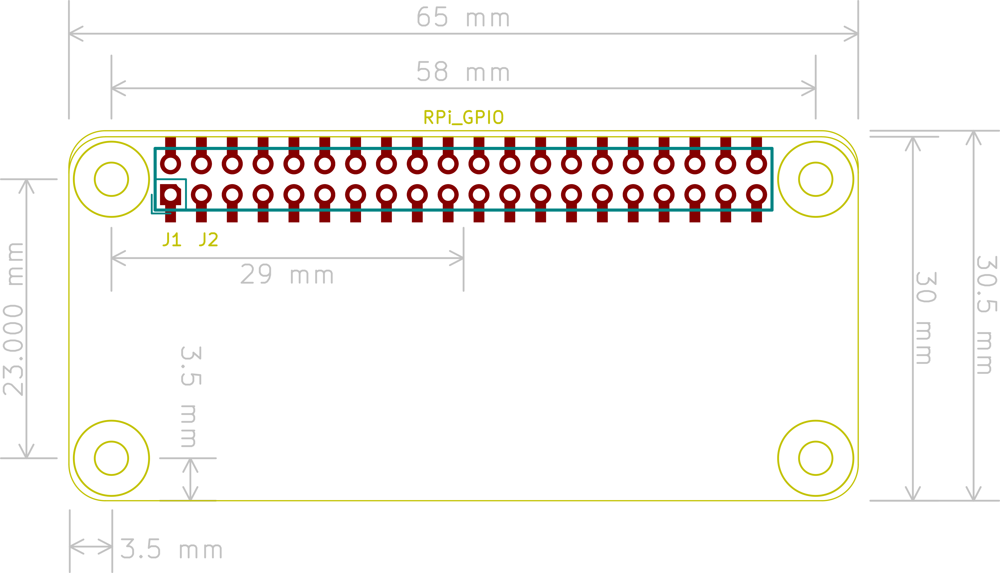

# Raspberry Pi Zero pHat template
This a KiCad template for a [Raspberry Pi Zero](https://www.raspberrypi.org/products/pi-zero/) sized pHat ('partial' Hat). It is based on the [Raspberry Pi B+ Hat template](https://github.com/xesscorp/RPi_Hat_Template) from Xess Corp. XESS Corp did all the hard work here.

Currently there is no definition for Raspberry Pi Zero Hats so the
[mechanical definition](https://www.raspberrypi.org/documentation/hardware/raspberrypi/mechanical/rpi-zero-v1_2_dimensions.pdf)
for the Raspberry Pi Zero itself was used instead.

Both a thru-hole and a surface mount connector are provided, along with a different PCB edge for each. Just keep the PCB edge and connector type that you're using for your design and delete the others.

The board outline looks like this:

## Status
This template has been used in a design successfully. See [RPi-pHat-Thermocouple](https://github.com/mikelawrence/RPi-pHat-Thermocouple)

## Using the Template
Follow the instructions listed in the original [Raspberry Pi B+ Hat template](https://github.com/xesscorp/RPi_Hat_Template) from XESS Corp.
